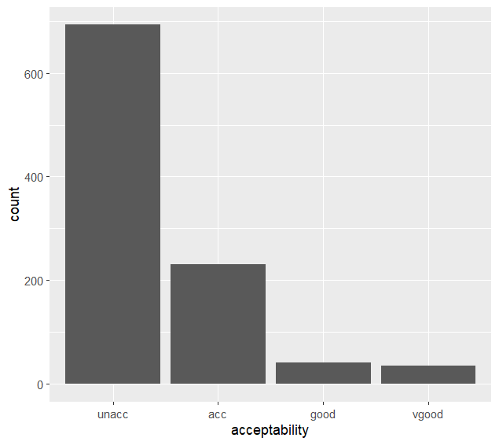
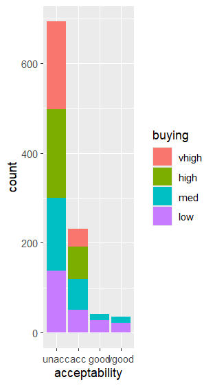
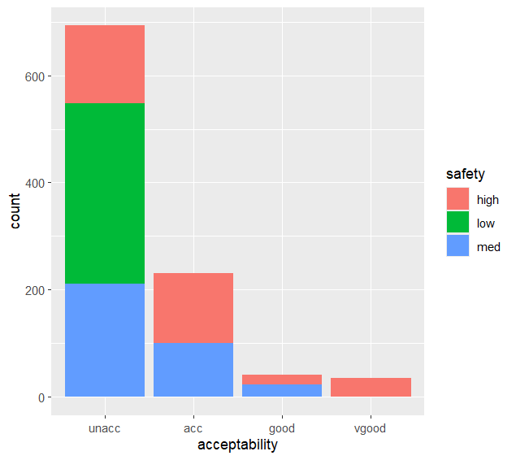
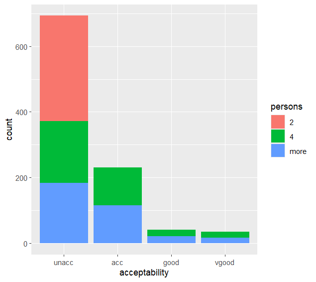
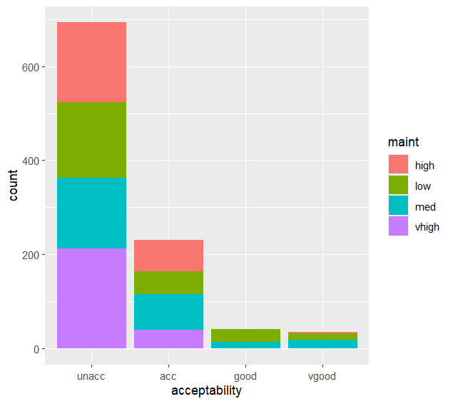

# Installing needed Packages

packages <- c("RWeka", "nnet", "caret", "class", "gmodels", "C50",
              "klaR", "e1071", "kernlab", "caTools", "ggplot2", "infotheo",
              "dplyr", "reshape2")

new.packages <- packages[!(packages %in% installed.packages()[, "Package"])] # %in% is contained 
if(length(new.packages)) install.packages(new.packages)

invisible(lapply(packages, library, character.only = TRUE))

# Importing DataSet 
source_file = "C:/Users/priya/OneDrive - Ulster University/University/Bsc (Hons) Computing System Ulster University/Year 2/Semester 2/project/CW2_Data_Analytics/car.csv"

df = read.csv(source_file)
df = data.frame(lapply(df, factor))

# 1. Exploratory data analysis and data preparation 

head(df)

summary(df)

str(df)
# table() function - Counting things 
table(df$acceptability) 

df$buying = factor(df$buying, levels = c("vhigh", "high", "med", "low"))

table(df$buying,df$acceptability) 
# It shows that low price is more likely to purchased by customers

summary(df)
# It tells us that our input features like buying, maint, doors, persons, lug_boot, and safety as roughly distributed data but our traget/outcome feature has undistributed data. 

table(df$safety, df$acceptability)
# It tells us that 35 high safety cars are vgood whereas low and med are not vgood. People very much high safety cars.

# Plot distributions of variables.
df$acceptability = factor(df$acceptability, levels = c("unacc","acc","good","vgood")) 
ggplot(df, aes(x=acceptability)) + geom_bar() 

# A grouped bar chart
ggplot(df, aes(x = acceptability, fill = buying ))+ geom_bar()

ggplot(df, aes(x = acceptability, fill = safety)) + geom_bar()

ggplot(df, aes(x = acceptability, fill = persons)) + geom_bar()

ggplot(df, aes(x = acceptability, fill = maint)) + geom_bar()

# Mutual information matrix
Mutual information tells you how strong a relationship is. But it doesn't tell you whether you can trust that relationship is real.

m = mutinformation(df)
m 

# A neat shortcut this is the quick way to see just the values you care about
m[7, -7]
max(m[-7, 7])

The diagonal represents self-information — also called entropy. It answers: "How uncertain am I about this variable to start with?"

# Chi- Squared Test(X^2)
Chi-squared compares two things:

Observed counts — what you actually see in your data
Expected counts — what you'd see if the two variables were completely unrelated
If observed and expected are close → the variables are likely independent (no real relationship).
If observed and expected are very different → the variables are likely related.
# The chi-squared statistic measures: how big is the gap between observed and expected?

chisq.test(df$buying, df$acceptability)

🔢 X-squared = 197.65 — the test statistic
This is the size of the gap between observed and expected. Bigger number = more evidence of a relationship.

Small X² (close to 0) = observed ≈ expected → variables likely independent
Large X² = observed very different from expected → variables likely related

But how big is "big"? That depends on df...
🔢 df = 9 — degrees of freedom
This is a technical adjustment based on the table's size. For two variables, it's (rows - 1) × (columns - 1). Here, buying has 4 levels and acceptability has 4 levels: (4-1) × (4-1) = 9.

🔢 p-value < 2.2e-16 — THE MOST IMPORTANT NUMBER ⭐
This is the probability that you'd see a relationship this strong by pure random chance, IF the two variables were actually independent.
🚨 This is the heart of every statistical test you'll ever do. Read carefully:
p-valueInterpretationp > 0.05Could easily be random luck → no significant relationshipp < 0.05Pretty unlikely to be luck → relationship is statistically significantp < 0.01Very unlikely to be luck → strong evidence of relationshipp < 0.001Vanishingly unlikely to be luck → overwhelming evidence
In our output, p-value < 2.2e-16 means smaller than 2.2 × 10⁻¹⁶ — basically a 0.00000000000000022 chance of being random. We are EXTREMELY confident buying and acceptability are related.

chisq.test(df$buying, df$maint)

🎯 The "null hypothesis" — a key concept
This is the foundation of all statistical tests, so let me give you a clean definition:

Null hypothesis (H₀): "There is NO relationship between the two variables." (The boring default assumption.)
Alternative hypothesis (H₁): "There IS a relationship."

The chi-squared test tries to reject the null hypothesis. If p-value is small enough (< 0.05), we say: "It's so unlikely we'd see this data under the null hypothesis that we reject it." → variables are related.
🎨 Courtroom analogy: Defendants are presumed innocent (the null hypothesis). The prosecution must show enough evidence (small p-value) to convict (reject the null). If the evidence is weak (big p-value), the defendant goes free (we keep the null).

chisq.test(df$safety, df$acceptability)
 If you ran that test, you'd see p < 2.2e-16 again — overwhelming evidence. Both MI and chi-squared agree: safety is strongly tied to acceptability. When two methods agree, you can trust the conclusion more. This is called triangulation of evidence, a research best practice

# Train/Test Split
This is Part 1(v) — the bridge between EDA and ML.

set.seed(123) # set.seed is about reproducibility — getting the same random result every time, not about fairness.
split = sample.split(df$acceptability, SplitRatio = 0.8)
df_train = subset(df, split == TRUE)
df_test = subset(df, split == FALSE)

#  Verify the split
Always sanity-check after splitting
summary(df_train)
summary(df_test)

Overfitting = when a model performs well on training data but poorly on new, unseen data.
The opposite is underfitting — when the model is too simple to even learn the training data well. 

# prop.table() converts counts into proportions (percentages divided by 100). You should see the proportions are very similar in train and test

prop.table(table(df_train$acceptability))
prop.table(table(df_test$acceptability))

nrow(df_train)
nrow(df_test)

# Machine Learning Algorithms 
Before we touch any algorithm, let me set up the map of what's coming.
The assignment asks you to apply 5 algorithms:

Decision Tree (C5.0) 🌳
Naive Bayes 🎲
Logistic Regression (multinomial) 📈
SVM (Support Vector Machine) ✂️
Neural Network 🧠

🎯 The universal ML workflow (memorise this!)
For every single algorithm, the steps are the same:
1. TRAIN — feed the algorithm the training data
   model = algorithm(training_features, training_target)

2. PREDICT — use the trained model to predict on the test data
   predictions = predict(model, test_data)

3. EVALUATE — compare predictions vs the true test answers
   confusionMatrix(predictions, true_test_labels)

 The simplest algorithm to start with: Decision Tree
Why start here? Because decision trees are the most intuitive ML algorithm in existence. A child can understand them.
🎨 Big analogy: Think of "20 Questions" — that game where you guess what someone is thinking by asking yes/no questions:

Q1: Is it alive? → Yes
Q2: Does it have fur? → Yes
Q3: Is it bigger than a cat? → No
Answer: It's a hamster! 🐹

A decision tree does exactly this with your data. It builds a series of questions like:

Q1: Is safety = low? → Yes → predict "unacc" 🚫
Q1: Is safety = low? → No → ask another question
Q2: Is persons = 2? → Yes → predict "unacc" 🚫
Q2: Is persons = 2? → No → ask another question
...etc

Why is it called "C5.0"?
Several decision tree algorithms exist. The most famous ones:

ID3 (1986)
C4.5 (1993, an improvement of ID3)
C5.0 (1998, an improvement of C4.5) — what you're using ⭐
CART (used in scikit-learn / Python)

They differ in HOW they decide which question to ask first (using metrics like information gain or Gini impurity), and in tricks for avoiding overfitting. C5.0 is one of the best for categorical data — perfect for our car dataset. ✨

# Training the model 

Decision tree algorithms 
dt_model = C5.0(df_train[-7], df_train$acceptability)

# Predict on the test set
Decision tree algorithms 
dt_pred = predict(dt_model, df_test)

# Evaluate 
# confusion matrix — a beautiful table showing what got predicted vs what was actually true. 
Decision tree algorithms 
confusionMatrix(dt_pred, df_test$acceptability)

